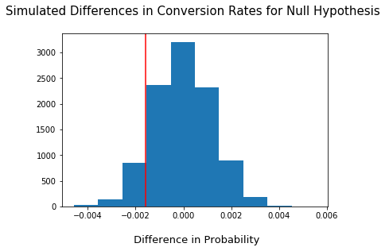

## Analyzing A/B Test Results

## Table of Contents
- [Introduction](#intro)
- [Part I - Probability](#probability)
- [Part II - A/B Test](#ab_test)
- [Part III - Regression](#regression)


<a id='intro'></a>
### Introduction

I conducted the below A/B test based on test results (**'ab_data.csv'**) from an e-commerce website. The company has developed a new web page in order to try and increase the number of users who "convert," meaning the number of users who decide to pay for the company's product. The purpose of this analysis is to help the company determine whether or not they should implement the new page, keep the old page, or perhaps run the experiment longer before making their decision.

<a id='probability'></a>
#### Part I - Probability


```python
# Importing libraries
import pandas as pd
import numpy as np
import random
import matplotlib.pyplot as plt
%matplotlib inline
#Setting the seed for consistent results
random.seed(42)
```


```python
# Reading in dataset
df = pd.read_csv('ab_data.csv')
df.head()
```


<div>
<table border="1" class="dataframe">
  <thead>
    <tr style="text-align: right;">
      <th></th>
      <th>user_id</th>
      <th>timestamp</th>
      <th>group</th>
      <th>landing_page</th>
      <th>converted</th>
    </tr>
  </thead>
  <tbody>
    <tr>
      <th>0</th>
      <td>851104</td>
      <td>2017-01-21 22:11:48.556739</td>
      <td>control</td>
      <td>old_page</td>
      <td>0</td>
    </tr>
    <tr>
      <th>1</th>
      <td>804228</td>
      <td>2017-01-12 08:01:45.159739</td>
      <td>control</td>
      <td>old_page</td>
      <td>0</td>
    </tr>
    <tr>
      <th>2</th>
      <td>661590</td>
      <td>2017-01-11 16:55:06.154213</td>
      <td>treatment</td>
      <td>new_page</td>
      <td>0</td>
    </tr>
    <tr>
      <th>3</th>
      <td>853541</td>
      <td>2017-01-08 18:28:03.143765</td>
      <td>treatment</td>
      <td>new_page</td>
      <td>0</td>
    </tr>
    <tr>
      <th>4</th>
      <td>864975</td>
      <td>2017-01-21 01:52:26.210827</td>
      <td>control</td>
      <td>old_page</td>
      <td>1</td>
    </tr>
  </tbody>
</table>
</div>


>**Note:** Users who get the old landing page are part of the "control" group, while those who get the new page are the "treatment" group. If a user ends up converting (pay for the company's product), a **"1"** appears in the **converted** column.


```python
# Finding number of rows in dataset
df.shape
```


    (294478, 5)


```python
# Checking for null values
df.info()
```

    <class 'pandas.core.frame.DataFrame'>
    RangeIndex: 294478 entries, 0 to 294477
    Data columns (total 5 columns):
    user_id         294478 non-null int64
    timestamp       294478 non-null object
    group           294478 non-null object
    landing_page    294478 non-null object
    converted       294478 non-null int64
    dtypes: int64(2), object(3)
    memory usage: 11.2+ MB
    

There doesn't appear to be any rows with missing values.


```python
# Finding number of unique users
df.user_id.nunique()
```


    290584


```python
# Calculating the proportion of users that converted
df.query('converted == 1').user_id.nunique() / df.user_id.nunique()
```


    0.12104245244060237


```python
# Calculating the number of times the 'new_page' and 'treatment' don't match
df[((df['group'] == 'treatment') == (df['landing_page'] == 'new_page')) == False].shape[0]
```


    3893


```python
# Calculating the number of times the 'old_page' and 'control' don't match
df[((df['group'] == 'control') == (df['landing_page'] == 'old_page')) == False].shape[0]
```


    3893


As identified above, there are rows in which the landing page doesn't match the appropriate group (i.e. 'new_page' being part of the 'treatment' group). For these, we cannot be sure whether each row truly received the new or old page. As such, I will be dropping these rows.


```python
# Creating a copy
df2 = df.copy()
df2.head()
```


<div>
<table border="1" class="dataframe">
  <thead>
    <tr style="text-align: right;">
      <th></th>
      <th>user_id</th>
      <th>timestamp</th>
      <th>group</th>
      <th>landing_page</th>
      <th>converted</th>
    </tr>
  </thead>
  <tbody>
    <tr>
      <th>0</th>
      <td>851104</td>
      <td>2017-01-21 22:11:48.556739</td>
      <td>control</td>
      <td>old_page</td>
      <td>0</td>
    </tr>
    <tr>
      <th>1</th>
      <td>804228</td>
      <td>2017-01-12 08:01:45.159739</td>
      <td>control</td>
      <td>old_page</td>
      <td>0</td>
    </tr>
    <tr>
      <th>2</th>
      <td>661590</td>
      <td>2017-01-11 16:55:06.154213</td>
      <td>treatment</td>
      <td>new_page</td>
      <td>0</td>
    </tr>
    <tr>
      <th>3</th>
      <td>853541</td>
      <td>2017-01-08 18:28:03.143765</td>
      <td>treatment</td>
      <td>new_page</td>
      <td>0</td>
    </tr>
    <tr>
      <th>4</th>
      <td>864975</td>
      <td>2017-01-21 01:52:26.210827</td>
      <td>control</td>
      <td>old_page</td>
      <td>1</td>
    </tr>
  </tbody>
</table>
</div>


```python
# Dropping mismatched rows
df2.drop(df2[(((df2['group'] == 'treatment') == (df2['landing_page'] == 'new_page')) == False)
         | (((df2['group'] == 'control') == (df2['landing_page'] == 'old_page')) == False)].index, inplace=True)
```


```python
# Double checking all of the correct rows were removed - this should be 0
df2[((df2['group'] == 'treatment') == (df2['landing_page'] == 'new_page')) == False].shape[0]
```


    0


```python
# Double checking all of the other correct rows were removed - this should be 0
df2[((df2['group'] == 'control') == (df2['landing_page'] == 'old_page')) == False].shape[0]
```


    0


```python
# Calculating how many unique users there are, after dropping mismatched rows
df2.user_id.nunique()
```


    290584


```python
# Looking for any duplicate user_id's
pd.concat(g for _, g in df2.groupby("user_id") if len(g) > 1)
```


<div>
<table border="1" class="dataframe">
  <thead>
    <tr style="text-align: right;">
      <th></th>
      <th>user_id</th>
      <th>timestamp</th>
      <th>group</th>
      <th>landing_page</th>
      <th>converted</th>
    </tr>
  </thead>
  <tbody>
    <tr>
      <th>1899</th>
      <td>773192</td>
      <td>2017-01-09 05:37:58.781806</td>
      <td>treatment</td>
      <td>new_page</td>
      <td>0</td>
    </tr>
    <tr>
      <th>2893</th>
      <td>773192</td>
      <td>2017-01-14 02:55:59.590927</td>
      <td>treatment</td>
      <td>new_page</td>
      <td>0</td>
    </tr>
  </tbody>
</table>
</div>


```python
# Dropping one of the duplicate user_id's
df2.drop(1899, inplace=True)
```


```python
# Confirming only one record remains
df2.query('user_id == 773192')
```


<div>
<table border="1" class="dataframe">
  <thead>
    <tr style="text-align: right;">
      <th></th>
      <th>user_id</th>
      <th>timestamp</th>
      <th>group</th>
      <th>landing_page</th>
      <th>converted</th>
    </tr>
  </thead>
  <tbody>
    <tr>
      <th>2893</th>
      <td>773192</td>
      <td>2017-01-14 02:55:59.590927</td>
      <td>treatment</td>
      <td>new_page</td>
      <td>0</td>
    </tr>
  </tbody>
</table>
</div>


```python
# Checking column datatypes
df2.info()
```

    <class 'pandas.core.frame.DataFrame'>
    Int64Index: 290584 entries, 0 to 294477
    Data columns (total 5 columns):
    user_id         290584 non-null int64
    timestamp       290584 non-null object
    group           290584 non-null object
    landing_page    290584 non-null object
    converted       290584 non-null int64
    dtypes: int64(2), object(3)
    memory usage: 13.3+ MB
    


```python
# Converting 'timestamp' column to datetime
df2['timestamp'] = pd.to_datetime(df2['timestamp'])
```


```python
df2.info()
```

    <class 'pandas.core.frame.DataFrame'>
    Int64Index: 290584 entries, 0 to 294477
    Data columns (total 5 columns):
    user_id         290584 non-null int64
    timestamp       290584 non-null datetime64[ns]
    group           290584 non-null object
    landing_page    290584 non-null object
    converted       290584 non-null int64
    dtypes: datetime64[ns](1), int64(2), object(2)
    memory usage: 13.3+ MB
    

Now that we have a clean dataset, we can proceed to generate the probabilities related to conversion.


```python
# Caculating the probability of an individual converting regardless of the page they receive
convert_mean = df2.converted.mean()
convert_mean
```


    0.11959708724499628


```python
# Calculating the probability an individual converted if they were in the control group
control_convert = df2.query('group == "control"').converted.mean()
control_convert
```


    0.1203863045004612


```python
# Calculating the probability an individual converted if they were in the treatment group
treat_convert = df2.query('group == "treatment"').converted.mean()
treat_convert
```


    0.11880806551510564


```python
# Calculating the probability an individual received the new page
df2.query('landing_page == "new_page"').count() / df.shape[0]
```


    user_id         0.493449
    timestamp       0.493449
    group           0.493449
    landing_page    0.493449
    converted       0.493449
    dtype: float64


**Based on the above calculations, I would say that there is not sufficient evidence to conclude that the new treatment page leads to more conversions. The conversion rate stays approximately 12%, regardless of which group and which landing page an individual was a part of.**

<a id='ab_test'></a>
### Part II - A/B Test

**Null Hypothesis:** The new page is no better, or even worse, than the old version (**𝑝_𝑛𝑒𝑤 ≤ 𝑝_𝑜𝑙𝑑**)

**Alternate Hypothesis:** The new version is better than the old version (**𝑝_𝑛𝑒𝑤 > 𝑝_𝑜𝑙𝑑**)

H0 : 𝑝_𝑛𝑒𝑤 - 𝑝_𝑜𝑙𝑑 ≤ 0

H1 : 𝑝_𝑛𝑒𝑤 - 𝑝_𝑜𝑙𝑑 > 0


```python
# Creating the p_new converstion rate under the null
p_new = df2.converted.mean()
p_new
```


    0.11959708724499628


```python
# Creating the p_old converstion rate under the null
p_old = df2.converted.mean()
p_old
```


    0.11959708724499628


```python
# Calculating the number of individuals in the treatment group (n_new)
n_new = df2.query('group == "treatment"').user_id.count()
n_new
```


    145310


```python
# Calculating the number of individuals in the control group (n_old)
n_old = df2.query('group == "control"').user_id.count()
n_old
```


    145274


Simulating n_new transactions with a conversion rate of p_new under the null. Storing these n_new 1's and 0's in **new_page_converted**.


```python
df2['new_page_converted'] = np.random.choice(2, df2.shape[0], p=[1-p_new, p_new])
```

Simulating n_old transactions with a conversion rate of p_old under the null. Storing these n_old 1's and 0's in **old_page_converted**.


```python
df2['old_page_converted'] = np.random.choice(2, df2.shape[0], p=[1-p_old, p_old])
```

Finding 𝑝_𝑛𝑒𝑤 - 𝑝_𝑜𝑙𝑑 for the simulated values above.


```python
# Not exactly zero due to rounding
df2.new_page_converted.mean() - df2.old_page_converted.mean()
```


    -6.538556837265563e-05


Running 10,000 𝑝_𝑛𝑒𝑤 - 𝑝_𝑜𝑙𝑑 simulations. Storing all 10,000 values in a NumPy array called **p_diffs**.


```python
p_new_array = np.random.binomial(n_new, p_new, 10000) / n_new
p_old_array = np.random.binomial(n_old, p_old, 10000) / n_old

p_diffs = p_new_array - p_old_array
```

Plotting a histogram of the **p_diffs**.


```python
# Seems to be normally distributed, as expected
plt.hist(p_diffs)
plt.title("Simulated Differences in Conversion Rates for Null Hypothesis \n", fontsize=15)
plt.xlabel("\n Difference in Probability", fontsize=13)
plt.axvline(treat_convert - control_convert, color='r');
```





Calculating the proportion of the **p_diffs** that are greater than the actual difference observed in **ab_data.csv**.


```python
obs_diff = treat_convert - control_convert
p_val = (p_diffs > obs_diff).mean()
p_val
```


    0.9039


**Results:** The calculated p-value is 0.9039. As this is drastically higher than the typical α level of 0.05, we fail to reject the null hypothesis and conclude that there is not sufficient evidence to say that there is a significant difference between the two pages.

>**Note:** The p-value is the probability of observing your statistic (or one more extreme in favor of the alternative) if the null hypothesis is true. An α level of 0.05 indicates that we have a 5% chance of committing a Type I error if the null is true.

**I will now compare my results to the built-in t-test.**

Calculating the number of conversions and individuals for both old and new web pages


```python
import statsmodels.api as sm

convert_old = df2.query('landing_page == "old_page" & converted == 1').user_id.count()
convert_new = df2.query('landing_page == "new_page" & converted == 1').user_id.count()
n_old = df2.query('landing_page == "old_page"').user_id.count()
n_new = df2.query('landing_page == "new_page"').user_id.count()
```

Now using `stats.proportions_ztest` to compute the test statistic and p-value.


```python
z_score, p_value = sm.stats.proportions_ztest([convert_old, convert_new], [n_old, n_new], alternative='smaller')
print(z_score, p_value)
```

    1.3109241984234394 0.9050583127590245
    

**Results:** Since the z-score is within the range of -1.96 and 1.96 (assuming a 95% significance level), we fail to reject the null hypothesis that the difference between the two proportions is no different from zero. This agrees with our previous findings.

<a id='regression'></a>
### Part III - A regression approach

In this section, I will be confirming the results from the previous section by performing a regression.

**Logistic Regression**

Creating a dummy variable and adding an intercept


```python
# Subbed 'ab_page' for 'treatment' column
df2['intercept'] = 1
df2[['control', 'ab_page']] = pd.get_dummies(df2['group'])
df2.drop('group', axis=1, inplace=True)
df2.head()
```


<div>
<table border="1" class="dataframe">
  <thead>
    <tr style="text-align: right;">
      <th></th>
      <th>user_id</th>
      <th>timestamp</th>
      <th>landing_page</th>
      <th>converted</th>
      <th>new_page_converted</th>
      <th>old_page_converted</th>
      <th>intercept</th>
      <th>control</th>
      <th>ab_page</th>
    </tr>
  </thead>
  <tbody>
    <tr>
      <th>0</th>
      <td>851104</td>
      <td>2017-01-21 22:11:48.556739</td>
      <td>old_page</td>
      <td>0</td>
      <td>0</td>
      <td>0</td>
      <td>1</td>
      <td>1</td>
      <td>0</td>
    </tr>
    <tr>
      <th>1</th>
      <td>804228</td>
      <td>2017-01-12 08:01:45.159739</td>
      <td>old_page</td>
      <td>0</td>
      <td>1</td>
      <td>0</td>
      <td>1</td>
      <td>1</td>
      <td>0</td>
    </tr>
    <tr>
      <th>2</th>
      <td>661590</td>
      <td>2017-01-11 16:55:06.154213</td>
      <td>new_page</td>
      <td>0</td>
      <td>0</td>
      <td>0</td>
      <td>1</td>
      <td>0</td>
      <td>1</td>
    </tr>
    <tr>
      <th>3</th>
      <td>853541</td>
      <td>2017-01-08 18:28:03.143765</td>
      <td>new_page</td>
      <td>0</td>
      <td>0</td>
      <td>0</td>
      <td>1</td>
      <td>0</td>
      <td>1</td>
    </tr>
    <tr>
      <th>4</th>
      <td>864975</td>
      <td>2017-01-21 01:52:26.210827</td>
      <td>old_page</td>
      <td>1</td>
      <td>0</td>
      <td>0</td>
      <td>1</td>
      <td>1</td>
      <td>0</td>
    </tr>
  </tbody>
</table>
</div>


Using **statsmodels** to instantiate and fit the regression model on the two columns created above to predict whether or not an individual converts.


```python
log_mod = sm.Logit(df2['converted'], df2[['intercept', 'ab_page']])
results = log_mod.fit()
```

    Optimization terminated successfully.
             Current function value: 0.366118
             Iterations 6
    

Generating the summary of the model below.


```python
results.summary()
```


<table class="simpletable">
<caption>Logit Regression Results</caption>
<tr>
  <th>Dep. Variable:</th>     <td>converted</td>    <th>  No. Observations:  </th>   <td>290584</td>   
</tr>
<tr>
  <th>Model:</th>               <td>Logit</td>      <th>  Df Residuals:      </th>   <td>290582</td>   
</tr>
<tr>
  <th>Method:</th>               <td>MLE</td>       <th>  Df Model:          </th>   <td>     1</td>   
</tr>
<tr>
  <th>Date:</th>          <td>Wed, 12 Jun 2019</td> <th>  Pseudo R-squ.:     </th>  <td>8.077e-06</td> 
</tr>
<tr>
  <th>Time:</th>              <td>05:28:54</td>     <th>  Log-Likelihood:    </th> <td>-1.0639e+05</td>
</tr>
<tr>
  <th>converged:</th>           <td>True</td>       <th>  LL-Null:           </th> <td>-1.0639e+05</td>
</tr>
<tr>
  <th> </th>                      <td> </td>        <th>  LLR p-value:       </th>   <td>0.1899</td>   
</tr>
</table>
<table class="simpletable">
<tr>
      <td></td>         <th>coef</th>     <th>std err</th>      <th>z</th>      <th>P>|z|</th>  <th>[0.025</th>    <th>0.975]</th>  
</tr>
<tr>
  <th>intercept</th> <td>   -1.9888</td> <td>    0.008</td> <td> -246.669</td> <td> 0.000</td> <td>   -2.005</td> <td>   -1.973</td>
</tr>
<tr>
  <th>ab_page</th>   <td>   -0.0150</td> <td>    0.011</td> <td>   -1.311</td> <td> 0.190</td> <td>   -0.037</td> <td>    0.007</td>
</tr>
</table>


**Results:** The 'ab_page' p-value is 0.19. This differs from the value found in Part II due to this being a two sided test with the null and alternative hypothesis changing for a logistic regression to:

Null: **𝑝_𝑛𝑒𝑤 = 𝑝_𝑜𝑙𝑑**

Alternative: **𝑝_𝑛𝑒𝑤 ≠ 𝑝_𝑜𝑙𝑑**

As this p-value remains above an α level of 0.05, we still fail to reject the null hypothesis.

>**Note:** Other things that might be good data points to include could be age, gender, and income level. This could be a good idea, since adding additional factors could shed more light on other sources that might be influencing whether someone converts, more so than the landing page. However, some of the disadvantages of doing so may be outliers and multi-collinearity.

**Adding an additional 'country' variable' to the model**

There is additional user country data that could affect conversion rates, sitting in the **'countries.csv'** dataset. A new model is created below to test for an interaction between the country of the user and the old/new page conversion rates.


```python
# Reading in countries.csv
df_cty = pd.read_csv('countries.csv')
df_cty.head()
```


<div>
<table border="1" class="dataframe">
  <thead>
    <tr style="text-align: right;">
      <th></th>
      <th>user_id</th>
      <th>country</th>
    </tr>
  </thead>
  <tbody>
    <tr>
      <th>0</th>
      <td>834778</td>
      <td>UK</td>
    </tr>
    <tr>
      <th>1</th>
      <td>928468</td>
      <td>US</td>
    </tr>
    <tr>
      <th>2</th>
      <td>822059</td>
      <td>UK</td>
    </tr>
    <tr>
      <th>3</th>
      <td>711597</td>
      <td>UK</td>
    </tr>
    <tr>
      <th>4</th>
      <td>710616</td>
      <td>UK</td>
    </tr>
  </tbody>
</table>
</div>


```python
# Joining dataframes
df2 = df2.join(df_cty.set_index('user_id'), on='user_id')
df2.head()
```


<div>
<table border="1" class="dataframe">
  <thead>
    <tr style="text-align: right;">
      <th></th>
      <th>user_id</th>
      <th>timestamp</th>
      <th>landing_page</th>
      <th>converted</th>
      <th>new_page_converted</th>
      <th>old_page_converted</th>
      <th>intercept</th>
      <th>control</th>
      <th>ab_page</th>
      <th>country</th>
    </tr>
  </thead>
  <tbody>
    <tr>
      <th>0</th>
      <td>851104</td>
      <td>2017-01-21 22:11:48.556739</td>
      <td>old_page</td>
      <td>0</td>
      <td>0</td>
      <td>0</td>
      <td>1</td>
      <td>1</td>
      <td>0</td>
      <td>US</td>
    </tr>
    <tr>
      <th>1</th>
      <td>804228</td>
      <td>2017-01-12 08:01:45.159739</td>
      <td>old_page</td>
      <td>0</td>
      <td>1</td>
      <td>0</td>
      <td>1</td>
      <td>1</td>
      <td>0</td>
      <td>US</td>
    </tr>
    <tr>
      <th>2</th>
      <td>661590</td>
      <td>2017-01-11 16:55:06.154213</td>
      <td>new_page</td>
      <td>0</td>
      <td>0</td>
      <td>0</td>
      <td>1</td>
      <td>0</td>
      <td>1</td>
      <td>US</td>
    </tr>
    <tr>
      <th>3</th>
      <td>853541</td>
      <td>2017-01-08 18:28:03.143765</td>
      <td>new_page</td>
      <td>0</td>
      <td>0</td>
      <td>0</td>
      <td>1</td>
      <td>0</td>
      <td>1</td>
      <td>US</td>
    </tr>
    <tr>
      <th>4</th>
      <td>864975</td>
      <td>2017-01-21 01:52:26.210827</td>
      <td>old_page</td>
      <td>1</td>
      <td>0</td>
      <td>0</td>
      <td>1</td>
      <td>1</td>
      <td>0</td>
      <td>US</td>
    </tr>
  </tbody>
</table>
</div>


```python
# Obtaining list of unique country values
df2.country.unique()
```


    array(['US', 'CA', 'UK'], dtype=object)


```python
# Creating dummy columns/variables
df2[['CA', 'UK', 'US']] = pd.get_dummies(df2['country'])
df2.drop('country', axis=1, inplace=True)
df2.head()
```


<div>
<table border="1" class="dataframe">
  <thead>
    <tr style="text-align: right;">
      <th></th>
      <th>user_id</th>
      <th>timestamp</th>
      <th>landing_page</th>
      <th>converted</th>
      <th>new_page_converted</th>
      <th>old_page_converted</th>
      <th>intercept</th>
      <th>control</th>
      <th>ab_page</th>
      <th>CA</th>
      <th>UK</th>
      <th>US</th>
    </tr>
  </thead>
  <tbody>
    <tr>
      <th>0</th>
      <td>851104</td>
      <td>2017-01-21 22:11:48.556739</td>
      <td>old_page</td>
      <td>0</td>
      <td>0</td>
      <td>0</td>
      <td>1</td>
      <td>1</td>
      <td>0</td>
      <td>0</td>
      <td>0</td>
      <td>1</td>
    </tr>
    <tr>
      <th>1</th>
      <td>804228</td>
      <td>2017-01-12 08:01:45.159739</td>
      <td>old_page</td>
      <td>0</td>
      <td>1</td>
      <td>0</td>
      <td>1</td>
      <td>1</td>
      <td>0</td>
      <td>0</td>
      <td>0</td>
      <td>1</td>
    </tr>
    <tr>
      <th>2</th>
      <td>661590</td>
      <td>2017-01-11 16:55:06.154213</td>
      <td>new_page</td>
      <td>0</td>
      <td>0</td>
      <td>0</td>
      <td>1</td>
      <td>0</td>
      <td>1</td>
      <td>0</td>
      <td>0</td>
      <td>1</td>
    </tr>
    <tr>
      <th>3</th>
      <td>853541</td>
      <td>2017-01-08 18:28:03.143765</td>
      <td>new_page</td>
      <td>0</td>
      <td>0</td>
      <td>0</td>
      <td>1</td>
      <td>0</td>
      <td>1</td>
      <td>0</td>
      <td>0</td>
      <td>1</td>
    </tr>
    <tr>
      <th>4</th>
      <td>864975</td>
      <td>2017-01-21 01:52:26.210827</td>
      <td>old_page</td>
      <td>1</td>
      <td>0</td>
      <td>0</td>
      <td>1</td>
      <td>1</td>
      <td>0</td>
      <td>0</td>
      <td>0</td>
      <td>1</td>
    </tr>
  </tbody>
</table>
</div>


```python
# Instantiating and fitting the model
log_mod = sm.Logit(df2['converted'], df2[['intercept', 'ab_page', 'CA', 'UK']])
results = log_mod.fit()
results.summary()
```

    Optimization terminated successfully.
             Current function value: 0.366113
             Iterations 6
    


<table class="simpletable">
<caption>Logit Regression Results</caption>
<tr>
  <th>Dep. Variable:</th>     <td>converted</td>    <th>  No. Observations:  </th>   <td>290584</td>   
</tr>
<tr>
  <th>Model:</th>               <td>Logit</td>      <th>  Df Residuals:      </th>   <td>290580</td>   
</tr>
<tr>
  <th>Method:</th>               <td>MLE</td>       <th>  Df Model:          </th>   <td>     3</td>   
</tr>
<tr>
  <th>Date:</th>          <td>Wed, 12 Jun 2019</td> <th>  Pseudo R-squ.:     </th>  <td>2.323e-05</td> 
</tr>
<tr>
  <th>Time:</th>              <td>05:28:56</td>     <th>  Log-Likelihood:    </th> <td>-1.0639e+05</td>
</tr>
<tr>
  <th>converged:</th>           <td>True</td>       <th>  LL-Null:           </th> <td>-1.0639e+05</td>
</tr>
<tr>
  <th> </th>                      <td> </td>        <th>  LLR p-value:       </th>   <td>0.1760</td>   
</tr>
</table>
<table class="simpletable">
<tr>
      <td></td>         <th>coef</th>     <th>std err</th>      <th>z</th>      <th>P>|z|</th>  <th>[0.025</th>    <th>0.975]</th>  
</tr>
<tr>
  <th>intercept</th> <td>   -1.9893</td> <td>    0.009</td> <td> -223.763</td> <td> 0.000</td> <td>   -2.007</td> <td>   -1.972</td>
</tr>
<tr>
  <th>ab_page</th>   <td>   -0.0149</td> <td>    0.011</td> <td>   -1.307</td> <td> 0.191</td> <td>   -0.037</td> <td>    0.007</td>
</tr>
<tr>
  <th>CA</th>        <td>   -0.0408</td> <td>    0.027</td> <td>   -1.516</td> <td> 0.130</td> <td>   -0.093</td> <td>    0.012</td>
</tr>
<tr>
  <th>UK</th>        <td>    0.0099</td> <td>    0.013</td> <td>    0.743</td> <td> 0.457</td> <td>   -0.016</td> <td>    0.036</td>
</tr>
</table>


```python
# Comparing CA to baseline (US)
1/np.exp(-0.0408)
```


    1.0416437559600236


If a user was from the US, they were 1.04 times more likely to convert than if they were from CA.


```python
# Comparing UK to baseline (US)
np.exp(0.0099)
```


    1.0099491671175422


If a user was from the UK, they were 1.0099 times more likely to convert than if they were from the US.

**Results:** From the resulting p-values above for CA and UK, it appears that 'country' does not have an impact on conversion, as none of the p-values seem statistically significant (p-value < 0.05). Therefore, we fail to reject the null hypothesis and conclude that there is not sufficient evidence that user country impacts whether or not a user converts.

**Now checking for an interaction between 'page' and 'country' to see if there are any significant effects on conversion.**


```python
# Creating the additional columns for each country/user blend
df2['uk_ab_combined'] = df2['UK'] * df2['ab_page']
df2['ca_ab_combined'] = df2['CA'] * df2['ab_page']
df2['us_ab_combined'] = df2['US'] * df2['ab_page']
df2.head()
```


<div>
<table border="1" class="dataframe">
  <thead>
    <tr style="text-align: right;">
      <th></th>
      <th>user_id</th>
      <th>timestamp</th>
      <th>landing_page</th>
      <th>converted</th>
      <th>new_page_converted</th>
      <th>old_page_converted</th>
      <th>intercept</th>
      <th>control</th>
      <th>ab_page</th>
      <th>CA</th>
      <th>UK</th>
      <th>US</th>
      <th>uk_ab_combined</th>
      <th>ca_ab_combined</th>
      <th>us_ab_combined</th>
    </tr>
  </thead>
  <tbody>
    <tr>
      <th>0</th>
      <td>851104</td>
      <td>2017-01-21 22:11:48.556739</td>
      <td>old_page</td>
      <td>0</td>
      <td>0</td>
      <td>0</td>
      <td>1</td>
      <td>1</td>
      <td>0</td>
      <td>0</td>
      <td>0</td>
      <td>1</td>
      <td>0</td>
      <td>0</td>
      <td>0</td>
    </tr>
    <tr>
      <th>1</th>
      <td>804228</td>
      <td>2017-01-12 08:01:45.159739</td>
      <td>old_page</td>
      <td>0</td>
      <td>1</td>
      <td>0</td>
      <td>1</td>
      <td>1</td>
      <td>0</td>
      <td>0</td>
      <td>0</td>
      <td>1</td>
      <td>0</td>
      <td>0</td>
      <td>0</td>
    </tr>
    <tr>
      <th>2</th>
      <td>661590</td>
      <td>2017-01-11 16:55:06.154213</td>
      <td>new_page</td>
      <td>0</td>
      <td>0</td>
      <td>0</td>
      <td>1</td>
      <td>0</td>
      <td>1</td>
      <td>0</td>
      <td>0</td>
      <td>1</td>
      <td>0</td>
      <td>0</td>
      <td>1</td>
    </tr>
    <tr>
      <th>3</th>
      <td>853541</td>
      <td>2017-01-08 18:28:03.143765</td>
      <td>new_page</td>
      <td>0</td>
      <td>0</td>
      <td>0</td>
      <td>1</td>
      <td>0</td>
      <td>1</td>
      <td>0</td>
      <td>0</td>
      <td>1</td>
      <td>0</td>
      <td>0</td>
      <td>1</td>
    </tr>
    <tr>
      <th>4</th>
      <td>864975</td>
      <td>2017-01-21 01:52:26.210827</td>
      <td>old_page</td>
      <td>1</td>
      <td>0</td>
      <td>0</td>
      <td>1</td>
      <td>1</td>
      <td>0</td>
      <td>0</td>
      <td>0</td>
      <td>1</td>
      <td>0</td>
      <td>0</td>
      <td>0</td>
    </tr>
  </tbody>
</table>
</div>


```python
# Instantiating and fitting the model
log_mod = sm.Logit(df2['converted'], df2[['intercept', 'ab_page', 'CA', 'UK', 'ca_ab_combined', 'uk_ab_combined']])
results = log_mod.fit()
results.summary()
```

    Optimization terminated successfully.
             Current function value: 0.366109
             Iterations 6
    


<table class="simpletable">
<caption>Logit Regression Results</caption>
<tr>
  <th>Dep. Variable:</th>     <td>converted</td>    <th>  No. Observations:  </th>   <td>290584</td>   
</tr>
<tr>
  <th>Model:</th>               <td>Logit</td>      <th>  Df Residuals:      </th>   <td>290578</td>   
</tr>
<tr>
  <th>Method:</th>               <td>MLE</td>       <th>  Df Model:          </th>   <td>     5</td>   
</tr>
<tr>
  <th>Date:</th>          <td>Wed, 12 Jun 2019</td> <th>  Pseudo R-squ.:     </th>  <td>3.482e-05</td> 
</tr>
<tr>
  <th>Time:</th>              <td>05:28:57</td>     <th>  Log-Likelihood:    </th> <td>-1.0639e+05</td>
</tr>
<tr>
  <th>converged:</th>           <td>True</td>       <th>  LL-Null:           </th> <td>-1.0639e+05</td>
</tr>
<tr>
  <th> </th>                      <td> </td>        <th>  LLR p-value:       </th>   <td>0.1920</td>   
</tr>
</table>
<table class="simpletable">
<tr>
         <td></td>           <th>coef</th>     <th>std err</th>      <th>z</th>      <th>P>|z|</th>  <th>[0.025</th>    <th>0.975]</th>  
</tr>
<tr>
  <th>intercept</th>      <td>   -1.9865</td> <td>    0.010</td> <td> -206.344</td> <td> 0.000</td> <td>   -2.005</td> <td>   -1.968</td>
</tr>
<tr>
  <th>ab_page</th>        <td>   -0.0206</td> <td>    0.014</td> <td>   -1.505</td> <td> 0.132</td> <td>   -0.047</td> <td>    0.006</td>
</tr>
<tr>
  <th>CA</th>             <td>   -0.0175</td> <td>    0.038</td> <td>   -0.465</td> <td> 0.642</td> <td>   -0.091</td> <td>    0.056</td>
</tr>
<tr>
  <th>UK</th>             <td>   -0.0057</td> <td>    0.019</td> <td>   -0.306</td> <td> 0.760</td> <td>   -0.043</td> <td>    0.031</td>
</tr>
<tr>
  <th>ca_ab_combined</th> <td>   -0.0469</td> <td>    0.054</td> <td>   -0.872</td> <td> 0.383</td> <td>   -0.152</td> <td>    0.059</td>
</tr>
<tr>
  <th>uk_ab_combined</th> <td>    0.0314</td> <td>    0.027</td> <td>    1.181</td> <td> 0.238</td> <td>   -0.021</td> <td>    0.084</td>
</tr>
</table>


```python
# Comparing ca_ab_combined to baseline (us_ab_combined)
1/np.exp(-0.0469)
```


    1.048017202119183


If a user was from the US and recieved the treatment page, they were 1.05 times more likely to convert than if they were from CA and recieved the treatment page.


```python
# Comparing uk_ab_combined to baseline (us_ab_combined)
np.exp(0.0314)
```


    1.0318981806179213


If a user was from the UK and recieved the treatment page, they were 1.03 times more likely to convert than if they were from the US and recieved the treatment page.

**Results:** From the resulting p-values above for 'ca_ab_combined' and 'uk_ab_combined', it appears that neither has an impact on conversion, as none of the p-values seem statistically significant (p-value < 0.05). Therefore, we fail to reject the null hypothesis and conclude that there is not sufficient evidence that an interaction between country and page impacts whether or not a user converts.

**Checking overall length of experiment**


```python
total_time = df2.timestamp.max() - df2.timestamp.min()
total_time
```


    Timedelta('21 days 23:59:49.081927')


**Results:** From the above, we can see that the experiment was only conducted over approximately 22 days. As such, a strong argument could be made to run the experiment for longer before running the statistical tests and coming to conclusions.
